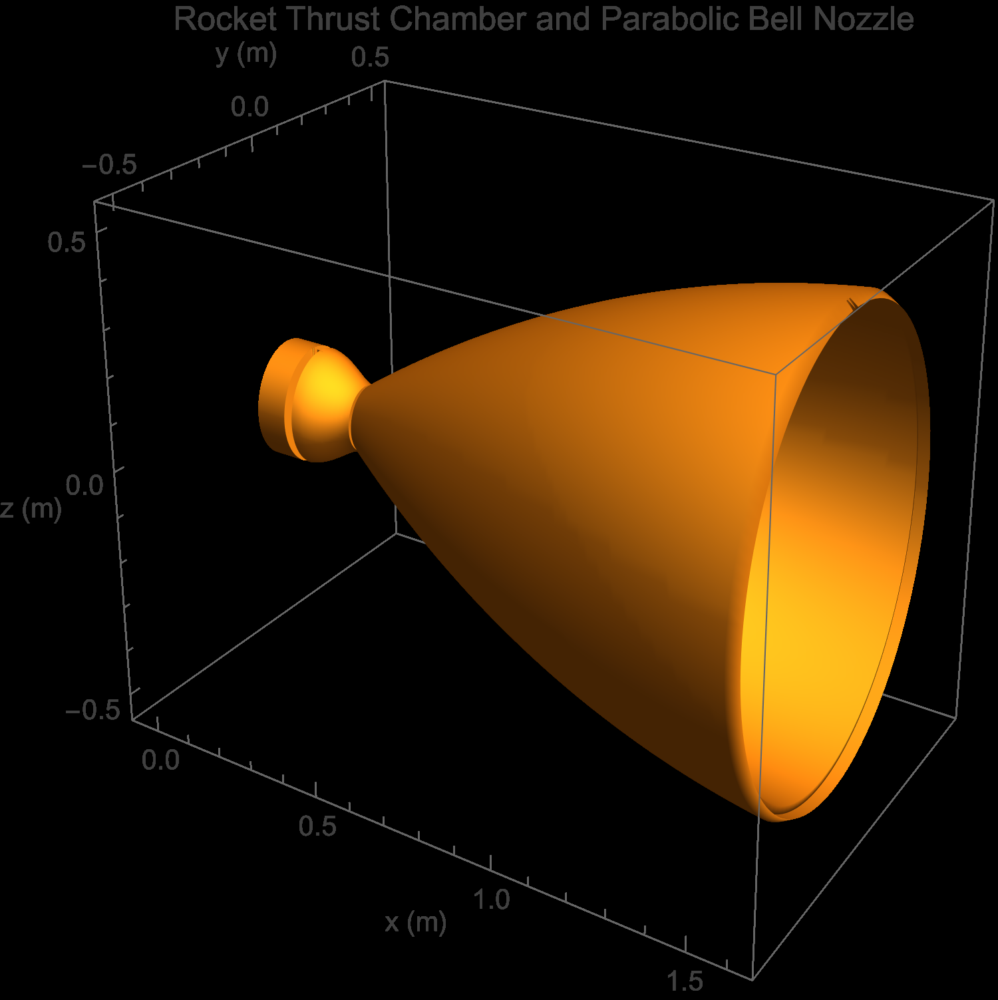
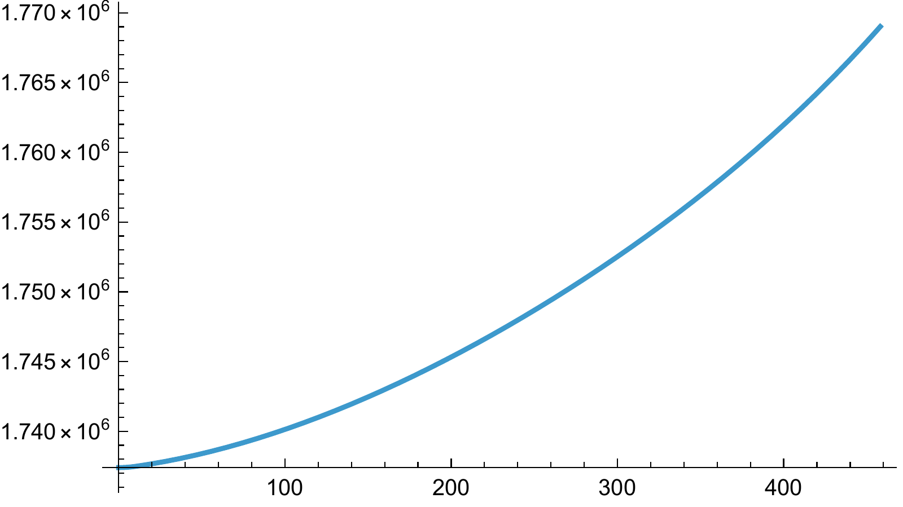
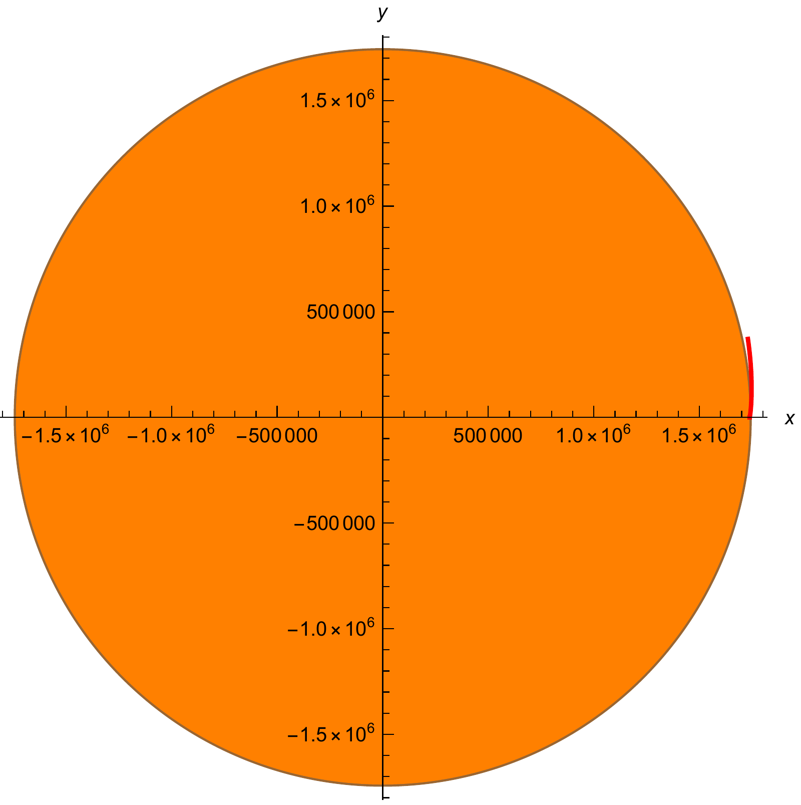
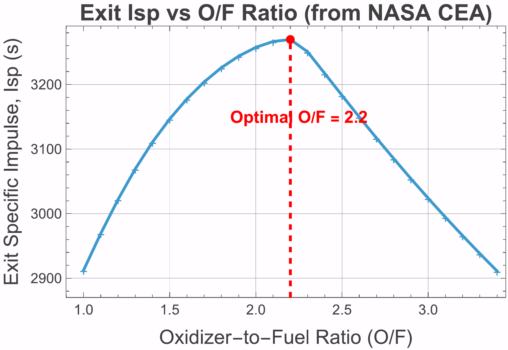
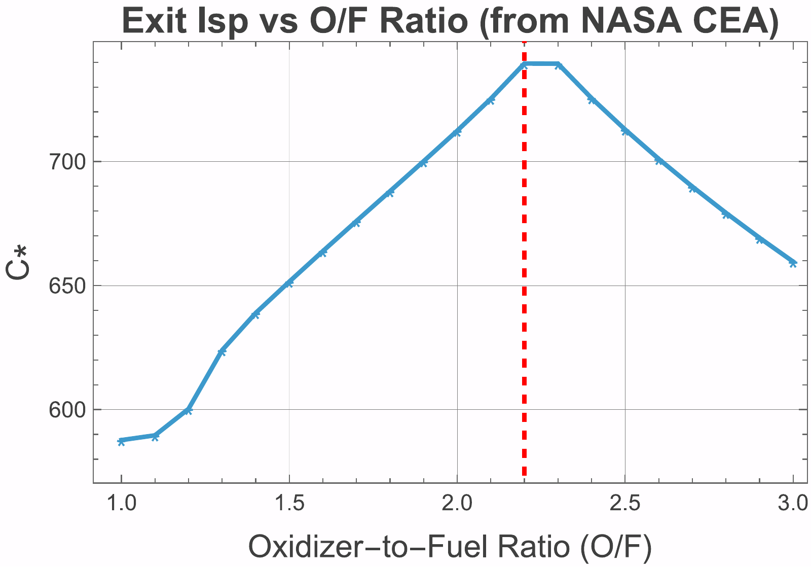
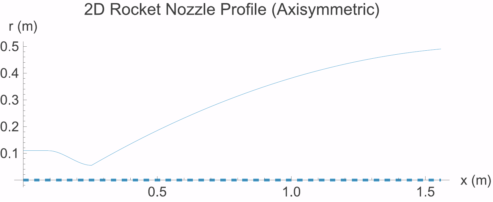
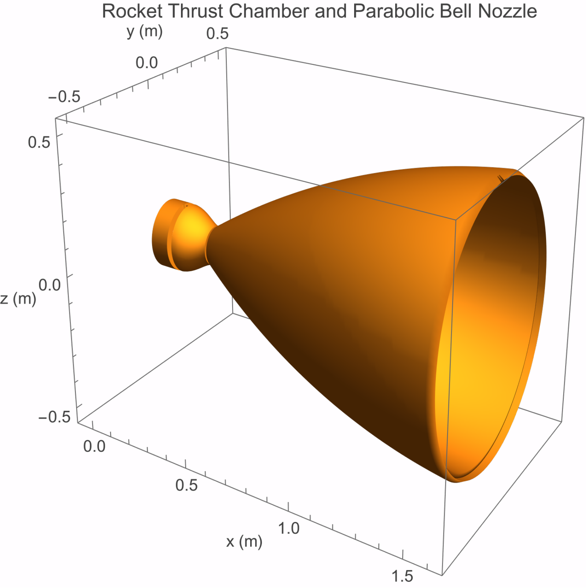
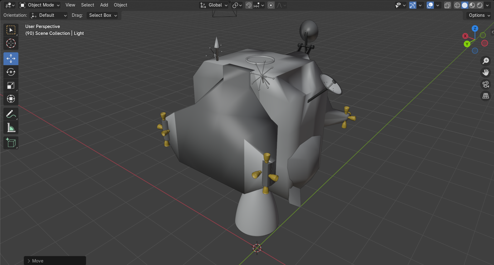
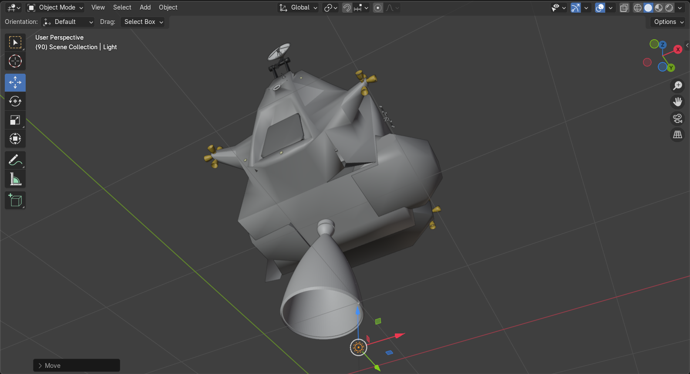
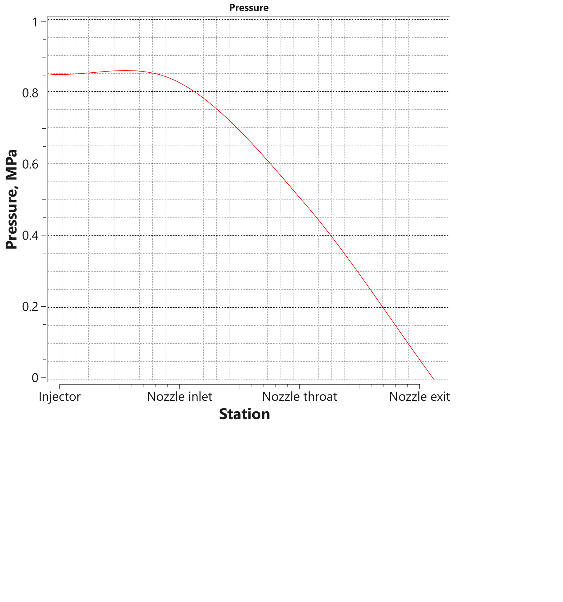

# Apollo Lunar Module: Ascent Trajectory and Engine Sizing

*Individual project · AE 401 Rocket Propulsion · Izmir University of Economics · Dec 2025 – Jan 2026*

## Engineering question
How does the Apollo Lunar Module ascent stage reach lunar orbit, and how is its Ascent Propulsion System engine sized?

## Approach
- Part 1: coupled radial–angular equations of motion in polar coordinates under thrust and lunar gravity, with a linear-tangent steering law and a parametric sweep of the initial pitch angle.
- Part 2: engine sizing with NASA CEA (thrust, nozzle configuration, propellant combination); 3D nozzle model in Mathematica integrated with a Blender model of the ascent stage.

## Results
- Insertion reached at a burn time of about 458 s with a speed of about 1933 m/s (see report for the full orbital-element survey).

## Validation
Checks against the reference mission values reported in the notebooks and report.

## Figures
Figures are taken from the two reports (figure numbers and captions as in each report). The PDF originals are kept in `figures/` next to each PNG.

**Part 1: ascent trajectory**

*Part 1, Figure 1: Radius versus time (single run, φ0 = 40°).*

*Part 1, Figure 2: Ascent trajectory in Cartesian coordinates (single run, φ0 = 40°).*

**Part 2: engine sizing and nozzle**

*Part 2, Figure 1: Exit specific impulse Isp vs. O/F ratio (from NASA CEA).*

*Part 2, Figure 2: Characteristic velocity C\* vs. O/F ratio (from NASA CEA).*

*Part 2, Figure 3: 2D view of the integrated nozzle.*

*Part 2, Figure 4: 3D view of the integrated nozzle.*

*Part 2, Figure 5: 3D view of the combined nozzle and Lunar Ascent Module (LAM) in Blender.*

*Part 2, Figure 6: 2D nozzle profile output.*

*Pressure from injector to nozzle exit (RPA output).*

## Tool files
| Path | Content | Opens with |
|---|---|---|
| `tools/cea/` | NASA CEA runs (O/F = 2.2 and the O/F sweep) as PDF | Any PDF reader |
| `tools/rpa/` | RPA (Rocket Propulsion Analysis) nozzle and performance results as PDF | Any PDF reader |
| `tools/FreeCAD/nozzle.FCStd` | Nozzle CAD model | [FreeCAD](https://www.freecad.org/) |
| `tools/FreeCAD/…-Nozzle-3D.stl` | 3D nozzle mesh exported for Blender | FreeCAD, Blender, any STL viewer (GitHub previews STL files) |
| `tools/blender/kaoutar-ammara-fall-2025-ae-401-project-1-part-2.blend` | Blender scene combining the nozzle with the ascent-stage model | [Blender](https://www.blender.org/) |
| `tools/blender/nasa-apollo-lunar-module.3ds`, `.stl`, `Apollo-Lunar-Module.glb` | Apollo Lunar Module 3D model files used as the base of the Blender scene. They are third-party models (the NASA model as named), not my work. | Blender, any 3D viewer |

## Repository contents
- `notebooks/`: Wolfram Language Jupyter notebooks (outputs saved, so results display directly on GitHub)
- `report/`: written reports (PDF)
- `figures/`: report figures (PDF originals with PNG copies for display on GitHub)
- `tools/`: CEA and RPA outputs, and FreeCAD and Blender models (see the table above)

## How to run
The notebooks use the Wolfram Language kernel for Jupyter (WolframLanguageForJupyter, Wolfram Engine or Mathematica 14).

## Credits
This project was completed on a course notebook framework by **Prof. Fabrizio Pinto** (Izmir University of Economics), released under CC BY 4.0. The completed notebook, results and written report in this repository are my own work.

## License
CC BY 4.0, consistent with the original course material. Please credit both Prof. Fabrizio Pinto and Kaoutar Ammara.

---
Kaoutar Ammara · Aerospace Engineer · [GitHub](https://github.com/Kiwiiiieee) · [LinkedIn](https://linkedin.com/in/kaoutar-ammara)
